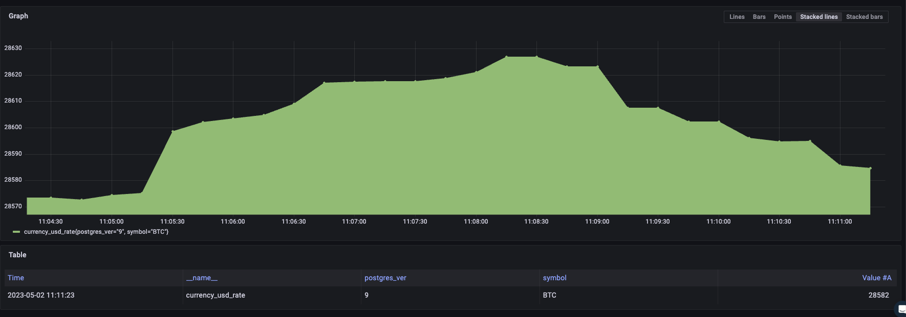

# OpenTelmetry Distro Testing

This repository contains code utilized to test and learn about the different features
of the OpenTelmetry Collector Distro. For the most part I have tested against the Contrib
collector agent. Unless it has been noted in the test.

# Receiver Sqlquery

The SQL Query Receiver uses custom SQL queries to generate metrics from a database connection.

For more details and code utilized please see the directory [postgresql](postgresql)

SQL query example:

```
currency=# select symbol, rate_usd from asset;
 symbol |     rate_usd
--------+------------------
 XOF    |     0.0016764259
 UAH    |     0.0272496322
 CRC    |     0.0018522634
 AOA    |     0.0019706084
 PLN    |     0.2400763251
 MXN    |     0.0553673588
 LKR    |     0.0031585052
 ETH    |  1861.6322423387
 .
 .
 CAD    |     0.7337322391
 CZK    |     0.0466083261
 KYD    |     1.2017078672
 XPF    |     0.0092151785
(182 rows)

```

OpenTelmetry Reciever Configuration:

This peforms a query agains postgresql 9 and then we create a metric called `currency_usd_rate` as a `guage` and we add label called `postgres_ver` and we set it to 9, we also add the symbol as an atribute as you can see in the screnshot below.

```
  sqlquery/9:
    driver: postgres
    datasource: "host=10.16.7.209 port=5438 user=postgres password=RQBP8395VaZHDDdkxw09 dbname=currency sslmode=disable"
    queries:
      - sql: "SELECT rate_usd, symbol FROM asset"
        metrics:
          - metric_name: currency_usd_rate
            value_column: "rate_usd"
            value_type: "double"
            attribute_columns: ["symbol"]
            static_attributes:
              postgres_ver: 9

```

Grafana Query Example:

```
currency_usd_rate{postgres_ver="9",symbol="BTC"}
```

Example output:


